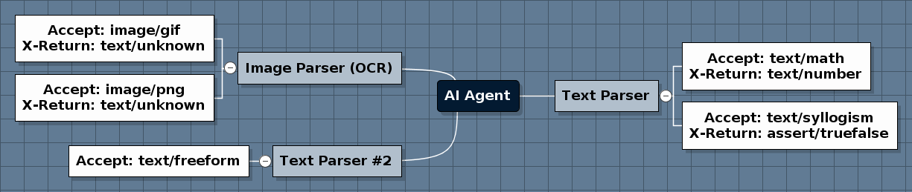

# aiagent
Primarily geared for artificial intelligence applications, this project defines a protocol and discovery discovery / registration mechanism to allow relaying of AI requests (natural language, speech, OCR, vision etc) along w/ plugins for ranking algorithms for results that are returned. 

